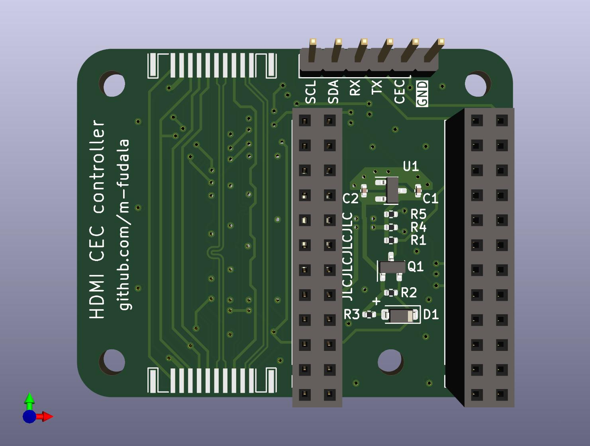

# ATmega32U4 CEC device
## Software
HDMI CEC protocol has been programmed using GPIO pins and timers.\
Full protocol feature set is to be done (address setting, commands etc.).&nbsp;&nbsp;

Sample message sent and received:

## Hardware
PCB has been designed as a pass-through between media player and a TV. Arduino Pro Micro is used as the brains of the device.
\
